# AI-Driven CAD Comparison & Analysis Engine

<div align="center">
  <h3>A professional full-stack application for automated CAD drawing comparison, visual difference detection, and AI-powered summarization.</h3>
  
  [](https://drive.google.com/file/d/1MF5Fktx6Yde4Cocno7VmKbGe130SMzTp/view?usp=sharing)
</div>

## 📖 Overview

The **AI-Based CAD Drawing Difference Detection** platform streamlines engineering and architectural workflows by automatically identifying discrepancies between two versions of a CAD drawing or technical diagram. 

Users upload a reference drawing and a modified version (supporting raster images, PDFs, and vector CAD files). The backend performs precise computer-vision-based alignment, extracts structural differences, and highlights changed regions with bounding boxes. It then integrates with a Large Language Model via the **Groq API** to provide an intelligent, plain-language summary of the detected changes, which is finally exported into a professional PDF report.

---

## ✨ Key Features

- **Multi-Format Support**: Seamlessly processes standard rasters (PNG, JPG), document formats (PDF), and vector CAD files (DXF, DWG).
- **Advanced Computer Vision Alignment**: Uses feature matching (ORB) combined with homography and Enhanced Correlation Coefficient (ECC) maximization to perfectly align shifted or scaled images.
- **Intelligent Difference Detection**: Isolates genuine structural changes from noise, intelligently grouping fragmented regions into clean bounding boxes.
- **Generative AI Summarization**: Connects to the Groq API to analyze the statistical differences and produce a readable, contextual summary for engineers.
- **Professional PDF Reporting**: Generates a high-quality, downloadable PDF containing side-by-side comparisons, colored difference overlays, area statistics, and the AI summary.
- **Modern UI**: A responsive, cleanly styled frontend built with React and Tailwind CSS.

---

## 🏗️ Architecture & Project Flow

```mermaid
flowchart LR
    %% Professional Styling
    classDef user fill:#2d3748,stroke:#4a5568,stroke-width:2px,color:#fff,rx:10,ry:10
    classDef frontend fill:#3182ce,stroke:#2b6cb0,stroke-width:2px,color:#fff,rx:5,ry:5
    classDef backend fill:#38a169,stroke:#2f855a,stroke-width:2px,color:#fff,rx:5,ry:5
    classDef cv fill:#d69e2e,stroke:#b7791f,stroke-width:2px,color:#fff,rx:5,ry:5
    classDef ai fill:#805ad5,stroke:#6b46c1,stroke-width:2px,color:#fff,rx:5,ry:5
    classDef pdf fill:#e53e3e,stroke:#c53030,stroke-width:2px,color:#fff,rx:5,ry:5

    %% Nodes & Grouping
    U([🧑‍💻 User]):::user

    subgraph Frontend [🌐 React + Vite Client]
        direction TB
        UI[Dashboard UI]:::frontend
        Axios[API Client]:::frontend
        UI <--> Axios
    end

    subgraph Backend [⚡ FastAPI Server]
        direction LR
        Router[API Router]:::backend
        Validator[File Validator]:::backend
        
        subgraph Pipeline [🔍 Computer Vision Core]
            direction TB
            Align[1. ORB + ECC Alignment]:::cv
            Diff[2. Image Subtraction]:::cv
            BBox[3. Bounding Boxes]:::cv
            Align --> Diff --> BBox
        end
        
        Groq[Groq API <br/> GenAI Summary]:::ai
        ReportLab[ReportLab <br/> PDF Generator]:::pdf
    end

    %% Workflow Connections
    U -- Uploads Files --> UI
    Axios -- Multipart Data --> Router
    Router --> Validator
    Validator --> Align
    
    BBox --> Groq
    BBox --> ReportLab
    Groq --> ReportLab
    
    ReportLab -- Returns PDF/JSON --> Router
    Router -- API Response --> Axios
    UI -- Displays Results --> U
```



---

## 🔍 Detailed Computer Vision Pipeline

The core of this application is its robust difference-detection pipeline. When two files are uploaded, they pass through the following internal steps:

1. **Standardization & Preprocessing** *(Libraries: `PyMuPDF`, `ezdxf`, `Pillow`, `NumPy`)*: 
   - Non-raster inputs (PDFs, DXFs) are rasterized into high-resolution PNG images.
   - Images are converted to arrays and standardized for downstream processing.
2. **Feature Detection (ORB)** *(Libraries: `OpenCV`)*: 
   - Oriented FAST and Rotated BRIEF (ORB) algorithms detect hundreds of distinct keypoints (corners, intersections) in both the reference and comparison images.
3. **Homography & Warp** *(Libraries: `OpenCV`)*:
   - A matcher identifies corresponding keypoints between the two images.
   - A perspective transformation (Homography matrix) is calculated to warp the comparison image so it exactly overlays the reference image, correcting for translation, rotation, and scaling differences.
4. **Sub-pixel Refinement (ECC)** *(Libraries: `OpenCV`)*:
   - To achieve pixel-perfect alignment crucial for thin CAD lines, an Enhanced Correlation Coefficient (ECC) algorithm mathematically refines the homography matrix.
5. **Difference Extraction & Morphological Filtering** *(Libraries: `scikit-image`, `OpenCV`)*:
   - Structural Similarity Index (SSIM) or Absolute difference is calculated between the aligned images.
   - Morphological operations (dilation and erosion) are applied to filter out micro-pixel noise (like anti-aliasing artifacts) and bolden genuine structural changes.
6. **Region Merging (Bounding Boxes)** *(Libraries: `OpenCV`, `NumPy`)*:
   - Contours are drawn around changed pixels. Overlapping or closely adjacent contours are algorithmically grouped and merged to prevent hundreds of fragmented boxes, ensuring clean, human-readable bounding box generation.
7. **Overlay & PDF Generation** *(Libraries: `OpenCV`, `ReportLab`, `Groq`)*:
   - The detected differences are highlighted in red and composited over a faded version of the original drawings for high-contrast visibility.
   - The Groq API is called to summarize findings, and `ReportLab` generates a professional PDF with the statistics, images, and summary.

---

## 💻 Tech Stack & Justification

### Backend
- **FastAPI**: Chosen for its high performance, asynchronous capabilities, and automatic OpenAPI documentation. It perfectly handles the compute-heavy, blocking tasks of computer vision pipelines.
- **OpenCV & NumPy**: The industry standard for high-performance image processing and matrix operations. OpenCV provides the highly optimized ORB and ECC alignment algorithms out-of-the-box.
- **PyMuPDF & ezdxf**: Essential lightweight libraries for parsing document (PDF) and vector (DXF) formats natively in Python without relying on heavy external CAD software.
- **Groq API**: Selected for its ultra-low-latency LPU (Language Processing Unit) inference, generating AI summaries almost instantly without creating a bottleneck in the API response time.
- **ReportLab**: Allows for programmatic, coordinate-based generation of PDF files, ensuring strict control over document layout for professional engineering reports.

### Frontend
- **React 18 & Vite**: Vite provides a lightning-fast development environment and optimized production builds. React's component-based architecture makes handling complex UI states (like image uploads and diff displays) manageable.
- **Tailwind CSS**: A utility-first CSS framework that allows for rapid, consistent, and highly responsive UI styling without writing bloated custom CSS files.

---

## 🚀 Local Development Guide

### 1. Backend Setup

The backend relies on Python 3.10+ and a virtual environment.

```bash
# Navigate to the backend directory
cd backend

# Create and activate a virtual environment
python -m venv .venv

# On Windows:
.venv\Scripts\activate
# On Mac/Linux:
# source .venv/bin/activate

# Install dependencies
pip install -r requirements.txt

# Set up environment variables (Windows)
set GROQ_API_KEY=your_groq_api_key_here
# (Mac/Linux: export GROQ_API_KEY=your_groq_api_key_here)

# Run the development server
uvicorn main:app --reload --host 0.0.0.0 --port 8000
```

### 2. Frontend Setup

The frontend is a Vite-powered React application.

```bash
# Navigate to the frontend directory
cd frontend

# Install Node.js dependencies
npm install

# Set the backend API URL (Windows)
set VITE_API_BASE_URL=http://localhost:8000
# (Mac/Linux: export VITE_API_BASE_URL=http://localhost:8000)

# Start the development server
npm run dev
```

Open your browser and navigate to `http://localhost:5173` to access the application.

---

## 📂 Sample Images
You can test the application using files provided in the `sample_images/` directory:
- Standard rasters: `reference.png` and `comparison.png`
- Vector drafts: `test_a.pdf` and `test_b.pdf`
- CAD files: Simple `.dxf` testing files

> **Note on DWG Support**: Due to the proprietary nature of DWG files, pure Python parsing is limited. The system handles DWG files by attempting to invoke external conversion tools (e.g., ODA File Converter). For robust DWG support in production, running the backend within a Docker container that pre-installs these dependencies is recommended.
